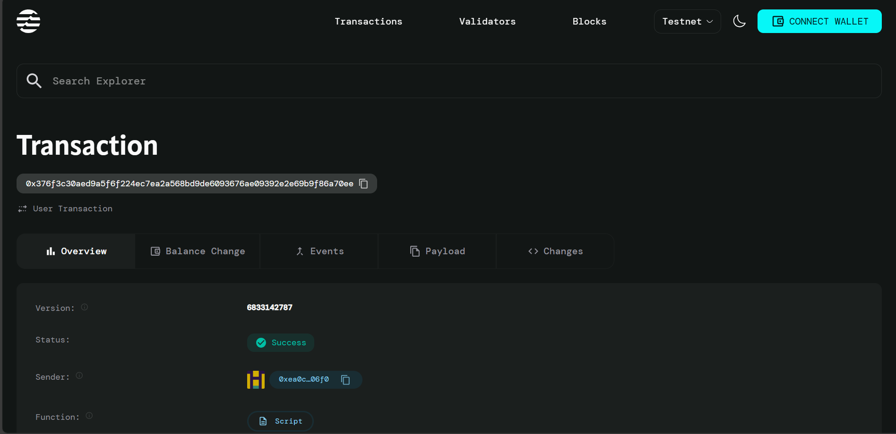

# Will and Testament

## Project Description

A blockchain-based digital inheritance management system built on the Aptos network. This smart contract enables individuals to create secure, automated digital wills that ensure their cryptocurrency assets are transferred to designated beneficiaries after a specified time period, eliminating the need for traditional legal intermediaries and providing transparent, immutable inheritance solutions.

## Project Vision

To revolutionize estate planning and digital asset inheritance by creating a decentralized, trustless system where individuals can securely manage and transfer their digital wealth to future generations. Our vision is to make inheritance planning accessible, affordable, and globally available while maintaining the highest standards of security and transparency through blockchain technology.

## Key Features

### 🔐 **Secure Will Creation**
- Create tamper-proof digital wills with predetermined inheritance amounts
- Set custom time-lock periods before inheritance becomes claimable
- Automatic fund locking mechanism ensures assets are reserved for beneficiaries

### ⏰ **Time-Based Inheritance**
- Flexible unlock timestamp system allows testators to set inheritance delays
- Prevents premature claims while ensuring rightful inheritance access
- Built-in timestamp verification using Aptos framework

### 🎯 **Beneficiary Protection**
- Single designated beneficiary per will for simplified inheritance
- Authorization verification ensures only legitimate beneficiaries can claim
- One-time claim system prevents double-spending of inheritance

### 💰 **Automated Fund Management**
- Seamless integration with AptosCoin for inheritance transfers
- Automatic balance verification before will creation
- Secure fund withdrawal and deposit mechanisms

### 🛡️ **Error Prevention**
- Comprehensive error handling for all edge cases
- Protection against unauthorized access and invalid operations
- Built-in checks for sufficient funds and claim eligibility

## Future Scope

### 📈 **Enhanced Features**
- **Multi-Beneficiary Support**: Extend functionality to support multiple beneficiaries with percentage-based distribution
- **Dynamic Will Updates**: Allow testators to modify beneficiaries or amounts before unlock periods
- **Emergency Override**: Implement emergency mechanisms for immediate inheritance access under specific conditions

### 🌐 **Cross-Chain Integration**
- **Multi-Blockchain Support**: Expand to Ethereum, Solana, and other major blockchain networks
- **Cross-Chain Asset Management**: Enable inheritance of assets across different blockchain ecosystems
- **Universal Wallet Integration**: Support for various cryptocurrency wallets and tokens

### 🤖 **Advanced Automation**
- **Oracle Integration**: Connect with real-world data sources for conditional inheritance triggers
- **AI-Powered Estate Planning**: Implement intelligent recommendations for optimal inheritance strategies
- **Automated Legal Compliance**: Integration with legal frameworks for regulatory compliance

### 🔄 **DeFi Integration**
- **Yield Generation**: Allow inheritance funds to earn yield while locked in the contract
- **Staking Mechanisms**: Enable automatic staking of locked assets for compound growth
- **Liquidity Pool Participation**: Integrate with DeFi protocols for enhanced returns

### 👥 **Social Features**
- **Family Tree Mapping**: Create comprehensive family inheritance networks
- **Guardian System**: Implement trusted guardians for complex inheritance scenarios
- **Communication Channels**: Enable secure messaging between testators and beneficiaries

## Contract Details
0x376f3c30aed9a5f6f224ec7ea2a568bd9de6093676ae09392e2e69b9f86a70ee

